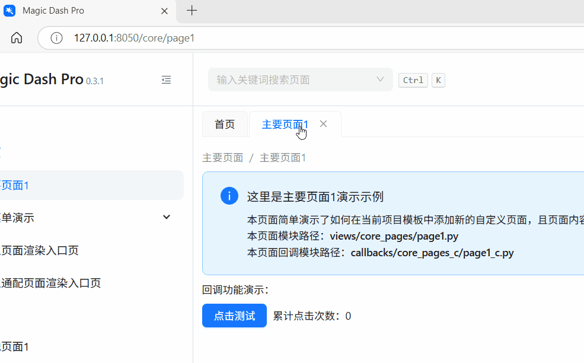
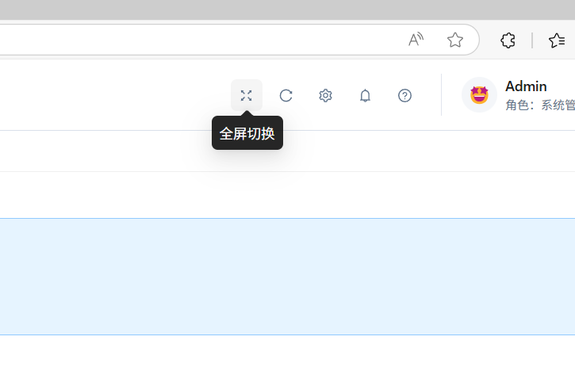
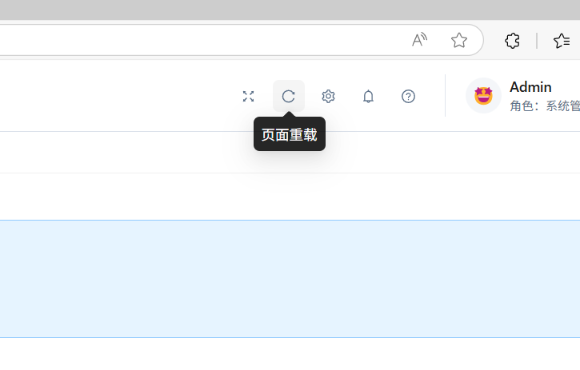

# 更新日志

## 0.3.2版本

### 新增

- `magic-dash-pro`模板新增**PostgreSQL**、**MySQL**数据库支持

  具体配置见`configs/database_config.py`中的相关参数

---

## 0.3.1版本

### 新增

- `magic-dash-pro`模板新增全屏自定义水印功能：

  对应`configs/base_config.py`中的参数`enable_fullscreen_watermark`、`fullscreen_watermark_generator`，可基于当前用户信息，进行全屏水印的自定义，示例配置：

```python
# 是否开启全屏额外水印功能
enable_fullscreen_watermark: bool = True

# 当开启了全屏额外水印功能时，用于动态处理实际水印内容输出
fullscreen_watermark_generator: Callable = (
    lambda current_user: current_user.user_name + "水印测试"
)
```

<p align="center">
    </img>
</p>

- `magic-dash`、`magic-dash-pro`模板标签页模式下，右键菜单新增刷新页面功能：

<p align="center">
    </img>
</p>

- `magic-dash`、`magic-dash-pro`模板，页首新增全屏切换按钮：

<p align="center">
    </img>
</p>

- `magic-dash`、`magic-dash-pro`模板，页首新增页面重载按钮：

<p align="center">
    </img>
</p>

- 内置各模板基于[feffery-dash-utils](https://github.com/CNFeffery/feffery-dash-utils)中的工具函数`check_python_version()`、`check_dependencies_version()`，对`Python`版本以及关键依赖库版本进行运行时强制检查，具体见各模板中的`app.py`开头相关代码

### 优化

- `magic-dash-pro`模板，针对`flask-login`用户加载函数涉及到的数据库查询操作进行优化，避免静态资源获取等非核心网络请求，触发完整的数据库查询操作额外增加计算开销

### 变化

- 内置各模板环境依赖`requirements.txt`更新，具体见：

  - [simple-tool](./magic_dash/templates/simple-tool/requirements.txt)

  - [magic-dash](./magic_dash/templates/magic-dash/requirements.txt)

  - [magic-dash-pro](./magic_dash/templates/magic-dash-pro/requirements.txt)
